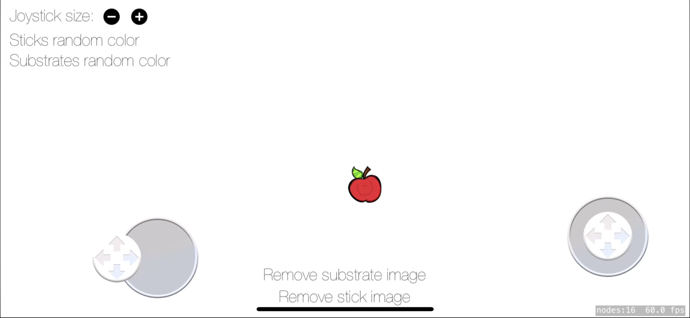

# AnalogJoystick

A powerful and flexible analog joystick control for SpriteKit games on iOS.

## 📹 Demo

See AnalogJoystick in action:

[](https://youtu.be/gxPmRu_mwlo)

## Features

* 🎮 Smooth analog control with customizable dead zones
* 🎨 Customizable appearance (colors, images, sizes)
* 📍 Fixed or moveable joystick positioning
* 👆 Multi-touch support
* 🔄 Event-driven architecture
* 🎯 Hidden area support for dynamic joystick placement
* ⚡ Velocity and angular position tracking
* 🧩 Easy integration as Swift Package

## Requirements

* iOS 12.0+
* Swift 5.0+
* SpriteKit

## Installation

### Method 1: Swift Package Manager (Recommended)

Add the following to your `Package.swift` file:

```swift
dependencies: [
    .package(url: "https://github.com/MitrofD/AnalogJoystick.git", from: "1.0.2")
]
```

Or in Xcode:

1. File → Add Package Dependencies...
2. Enter the repository URL: `https://github.com/MitrofD/AnalogJoystick.git`
3. Select version and add to your target

### Method 2: Manual Installation

If you prefer to manually add the files to your project:

1. Download or clone this repository
2. Copy the `Sources/AnalogJoystick` folder into your project
3. Make sure the files are added to your target

The package contains:
- `AnalogJoystick.swift` - Main joystick component
- `AnalogJoystickComponent.swift` - Visual components (base and handle)
- `AnalogJoystickData.swift` - Data structures
- `AnalogJoystickHiddenArea.swift` - Hidden area for dynamic positioning

## Usage

### Basic Setup

```swift
import SpriteKit
import AnalogJoystick

class GameScene: SKScene {
    let joystick = AnalogJoystick(withDiameter: 100)
    
    override func didMove(to view: SKView) {
        // Position the joystick
        joystick.position = CGPoint(x: 100, y: 100)
        addChild(joystick)
        
        // Handle joystick events
        joystick.on(.move) { joystick in
            print("Velocity: \(joystick.velocity)")
            print("Angular: \(joystick.angular)")
        }
    }
}
```

### Hidden Area (Dynamic Positioning)

Create a joystick that appears where the user touches:

```swift
let hiddenArea = AnalogJoystickHiddenArea(
    rect: CGRect(x: 0, y: 0, width: frame.midX, height: frame.height)
)
hiddenArea.joystick = AnalogJoystick(withDiameter: 100)
hiddenArea.joystick?.isMoveable = true
addChild(hiddenArea)
```

### Event Handling

```swift
// Track when joystick starts moving
joystick.on(.begin) { joystick in
    print("Started moving")
}

// Track joystick movement
joystick.on(.move) { joystick in
    let velocity = joystick.velocity
    player.position.x += velocity.x * speed
    player.position.y += velocity.y * speed
}

// Track when joystick stops
joystick.on(.end) { joystick in
    print("Stopped moving")
}
```

### Advanced Example

```swift
class GameScene: SKScene {
    var player: SKSpriteNode?
    let moveJoystick = AnalogJoystick(withDiameter: 100)
    let rotateJoystick = AnalogJoystick(withDiameter: 100)
    
    override func didMove(to view: SKView) {
        // Setup move joystick with hidden area
        let moveArea = AnalogJoystickHiddenArea(
            rect: CGRect(x: 0, y: 0, width: frame.midX, height: frame.height)
        )
        moveArea.joystick = moveJoystick
        moveJoystick.isMoveable = true
        addChild(moveArea)
        
        // Setup rotation joystick
        rotateJoystick.position = CGPoint(
            x: size.width - rotateJoystick.diameter,
            y: rotateJoystick.diameter
        )
        addChild(rotateJoystick)
        
        // Handle player movement
        moveJoystick.on(.move) { [unowned self] joystick in
            guard let player = self.player else { return }
            let speed: CGFloat = 5
            
            player.position.x += joystick.velocity.x * speed
            player.position.y += joystick.velocity.y * speed
        }
        
        // Handle player rotation
        rotateJoystick.on(.move) { [unowned self] joystick in
            self.player?.zRotation = joystick.angular
        }
    }
}
```

## Customization

### Appearance

```swift
// Custom colors
joystick.baseColor = .gray
joystick.handleColor = .red

// Custom images
joystick.baseImage = UIImage(named: "joystick-base")
joystick.handleImage = UIImage(named: "joystick-stick")

// Custom sizes
joystick.diameter = 150
joystick.handleRatio = 0.6 // Handle size relative to base
```

### Behavior

```swift
// Dead zone (0.0 - 1.0)
joystick.deadZone = 0.1

// Velocity curve exponent (higher = less sensitive in center)
joystick.velocityExponent = 1.5

// Allow joystick to move when handle reaches edge
joystick.isMoveable = true

// Reset animation duration
joystick.resetDuration = 0.2

// Disable joystick
joystick.disabled = true
```

## Properties

### AnalogJoystick

| Property | Type | Description |
| --- | --- | --- |
| `velocity` | `CGPoint` | Normalized velocity (-1 to 1) on both axes |
| `angular` | `CGFloat` | Angle in radians |
| `tracking` | `Bool` | Whether joystick is currently being touched |
| `deadZone` | `CGFloat` | Minimum movement threshold (0.0 - 1.0) |
| `velocityExponent` | `CGFloat` | Power curve for velocity sensitivity |
| `isMoveable` | `Bool` | Whether joystick moves when handle reaches edge |
| `disabled` | `Bool` | Enable/disable joystick interaction |

## License

This project is licensed under the MIT License - see the LICENSE file for details.

## Author

Dmitriy Mitrofansky

## Contributing

Contributions are welcome! Please feel free to submit a Pull Request.
